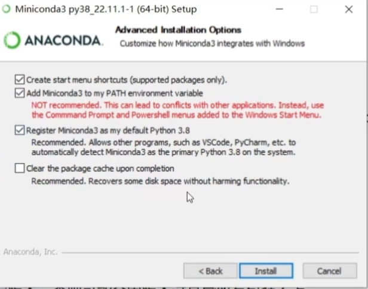

# YOLOv8 航拍树木与石头检测——零基础中文使用手册

## 1. 环境配置

本节从一台尚未安装 Python 的 Windows 电脑开始。除安装程序的图形界面外，后续命令都在 **Windows CMD** 中执行；激活 `yolov8` 后，后续 Python、pip、训练和预测命令都必须保持在这个虚拟环境中。

### 1.1 下载并安装 Miniconda

打开下面的清华大学开源软件镜像站链接，下载 Miniconda 安装程序：

<https://mirrors.tuna.tsinghua.edu.cn/anaconda/miniconda/Miniconda3-py38_22.11.1-1-Windows-x86_64.exe>

建议安装在 C 盘。安装到 **Advanced Installation Options** 页面时，勾选：

```text
Add Miniconda3 to my PATH environment variable
```

安装选项如下图所示：



安装完成后关闭旧的 CMD，再重新打开一个 CMD，使新的 PATH 设置生效。

### 1.2 创建 Python 3.8 虚拟环境

在 CMD 中运行：

```bat
conda create -n yolov8 python=3.8
```

下载选项询问：

```text
Proceed ([y]/n)?
```

输入：

```text
y
```

然后按回车，等待环境创建完成。

### 1.3 激活虚拟环境

运行：

```bat
conda activate yolov8
```

命令行左边出现 `(yolov8)`，表示已经进入正确环境。以后每次重新打开 CMD，都需要先运行这条命令。

### 1.4 设置清华 PyPI 默认源

在已经激活的 `yolov8` 环境中运行：

```bat
pip config set global.index-url https://mirrors.tuna.tsinghua.edu.cn/pypi/web/simple
```

此设置会让以后大多数 pip 软件包默认从清华镜像下载。

### 1.5 安装 PyTorch

本项目使用支持 CUDA 的 PyTorch 1.13.1。建议使用支持 CUDA 的 NVIDIA GTX 10 系或更新显卡，不限定具体型号。

运行：

```bat
pip install torch==1.13.1+cu116 torchvision==0.14.1+cu116 torchaudio==0.13.1 --extra-index-url https://download.pytorch.org/whl/cu116
```

这一命令中的 PyTorch 文件来自官方 CUDA 11.6 软件源。

### 1.6 下载并安装 Ultralytics 源码

从下面的官方 GitHub 下载地址获取 ZIP：

<https://codeload.github.com/ultralytics/ultralytics/zip/refs/heads/main>

下载完成后：

1. 解压 ZIP。
2. 确认解压后的文件夹名为 `ultralytics-main`。
3. 将整个 `ultralytics-main` 文件夹复制到 Windows 桌面。

在 CMD 中进入这个文件夹：

```bat
cd  "%USERPROFILE%\Desktop\ultralytics-main"
```

使用可编辑方式安装源码：

```bat
pip install -e .
```

`-e` 表示可编辑安装。以后查看或修改桌面上的 Ultralytics 源码，不需要反复复制源码。

### 1.7 下载本项目

打开项目仓库：

<https://github.com/zhangyunzhi062-sketch/test>

在 GitHub 页面点击 **Code → Download ZIP**，下载并解压项目。也可以直接使用：

<https://github.com/zhangyunzhi062-sketch/test/archive/refs/heads/main.zip>

项目可以解压到任意有足够空间的位置。打开解压后的项目文件夹，在资源管理器地址栏复制完整路径，然后在 CMD 中运行：

```bat
cd  "项目解压目录"
```

例如，如果地址栏显示某个实际路径，就把上面引号中的“项目解压目录”整体替换成该路径。不要原样输入占位文字。

安装项目的轻量依赖：

```bat
pip install -r requirements.txt
```

项目 ZIP 已包含 `database` 中的三套数据，不需要另行下载数据集，也不需要修改盘符或用户名。

## 2. 程序目标

这个项目会完成两件事：

1. 用项目自带的三套数据训练一个属于自己的 YOLOv8 模型。
2. 把一张新的航拍图片交给模型，输出带检测框的图片，并记录每个目标是树木还是石头。

第一版模型只有两个类别：

| 编号 | 英文名称 | 含义 |
| --- | --- | --- |
| 0 | `tree` | 树木、树冠，以及 Nature 数据集中的树干 |
| 1 | `stone` | 石头、岩块 |

## 3. 项目目录与数据

解压后的关键结构如下：

```text
项目解压目录/
├── database/
│   ├── Nature objects.v1i.yolov8/
│   ├── open-pit-rock-chunks-test.v3i.yolov8/
│   └── Tree-Top-View.v1i.yolov8/
├── config/
│   └── project.yaml
├── docs/
│   └── images/
├── uav_yolo/
├── check_environment.py
├── prepare_dataset.py
├── train.py
└── predict_image.py
```

所有配置都使用项目相对路径。因此项目无论解压到哪个磁盘或用户目录，只要保持内部目录结构不变，就可以使用，目录尽量不要出现中文。

数据准备后会新建：

```text
generated/uav-tree-stone.v1.yolov8/
```

训练和预测还会分别新建：

```text
runs/
outputs/
```

这些生成目录已经加入 `.gitignore`，不会意外提交到 GitHub。

程序只读取 `database` 中的原始数据，不会修改它们。

## 4. 每次使用前

每次重新打开 CMD，都先运行：

```bat
conda activate yolov8
cd  "项目解压目录"
```

看到命令行左边出现 `(yolov8)` 后，再运行后面的项目命令。

路径中如果有空格或中文，始终使用英文双引号包住整个路径。

## 5. 检查运行环境

运行：

```bat
python check_environment.py
```

程序会显示：

- 当前是否在 `yolov8` 环境；
- Python、PyTorch、Ultralytics 版本；
- CUDA 是否可用；
- 当前电脑检测到的显卡；
- 一个非常小的 CUDA 运算是否成功。

理想结果的关键部分是：

```text
Conda 环境：yolov8
Python：3.8...
PyTorch：1.13.1+cu116
CUDA 可用：是
最小 CUDA 运算：通过
```

只要没有 `[错误]`，并且最小 CUDA 运算通过，就可以继续。不同电脑显示的显卡名称和 Ultralytics 版本可能不同，这是正常现象。

## 6. 合并和检查数据集

项目已经带有三套原始数据。第一次训练前运行：

```bat
python prepare_dataset.py --config config\project.yaml
```

程序会：

1. 检查 `database` 中三个数据集的 train、valid、test 目录；
2. 统一类别编号；
3. 把石头多边形转换为检测框；
4. 为文件名增加数据源前缀，避免同名文件互相覆盖；
5. 复制到 `generated/uav-tree-stone.v1.yolov8`；
6. 创建统一的 `data.yaml` 和 `dataset_manifest.json`。

成功后会显示每个划分的图片数、树木目标数和石头目标数。

### 如何确认结果

项目中应出现：

```text
generated/
└── uav-tree-stone.v1.yolov8/
    ├── train/
    ├── valid/
    ├── test/
    ├── data.yaml
    ├── dataset_manifest.json
    └── .uav_yolo_prepared.json
```

`dataset_manifest.json` 是统计清单；`.uav_yolo_prepared.json` 是安全标记。

### 重新生成

确认旧的派生数据不再需要时运行：

```bat
python prepare_dataset.py --config config\project.yaml --overwrite
```

程序只允许覆盖带有安全标记的派生目录。如果目录不是本程序创建的，它会拒绝删除，防止误删文件。

## 7. 第一次训练模型

建议先做一次 5 轮的小规模流程检查：

```bat
python train.py --config config\project.yaml --epochs 5
```

这仍然是真实训练，只是轮数少，主要用来确认数据和显卡能正常工作。确认无误后，再进行正式训练：

```bat
python train.py --config config\project.yaml
```

默认设置是：

| 参数 | 默认值 | 解释 |
| --- | --- | --- |
| 模型 | `yolov8n.pt` | 体积最小的 YOLOv8 检测模型 |
| epochs | 100 | 完整学习数据 100 次 |
| imgsz | 640 | 输入图片缩放到 640 像素 |
| batch | 8 | 每次送入显卡 8 张图片 |
| device | 0 | 使用第 1 张可用 NVIDIA 显卡 |
| workers | 0 | Windows 下最稳妥的数据加载方式 |
| patience | 30 | 30 轮没有改善就提前停止 |

第一次使用 `yolov8n.pt` 时，Ultralytics 可能自动联网下载预训练权重。这个文件不来自清华 PyPI 镜像，所以下载速度取决于 GitHub 网络，这意味着直连用户可能需要一些加速手段。

### 训练结果的存储位置

通常保存在项目内：

```text
runs/detect/uav_tree_stone/
```

如果这个目录已经存在，Ultralytics 可能创建带数字后缀的新目录。以训练开始时命令行显示的实际输出目录为准。

最重要的文件是：

```text
weights/best.pt
weights/last.pt
results.csv
results.png
confusion_matrix.png
```

- `best.pt`：验证效果最好的权重，平常检测图片优先使用它。
- `last.pt`：最后一轮的权重，训练意外中断后可以用它继续。

### 训练中断后继续的方法

把路径换成命令行实际显示目录中的 `last.pt`：

```bat
python train.py --resume "runs\detect\uav_tree_stone\weights\last.pt"
```

如果输出目录带数字后缀，命令中的目录也要相应修改。

### 显存不足问题的处理方法

如果看到 `CUDA out of memory`，先减小 batch：

```bat
python train.py --config config\project.yaml --batch 4
```

还不行就改为：

```bat
python train.py --config config\project.yaml --batch 2
```

不要一开始就换更大的 `yolov8s.pt`、`yolov8m.pt`，因为它们会占用更多显存。

## 8. 怎么判断模型效果

训练目录中的图表会包含以下指标：

- **Precision（精确率）**：模型框出来的目标中，有多少是真的。
- **Recall（召回率）**：真实目标中，有多少被模型找到了。
- **mAP50**：在较宽松的重叠标准下综合评价检测效果。
- **mAP50-95**：在多种严格程度下的综合评价，比 mAP50 更严格。

不要只看训练集。验证集指标高、真实航拍图片效果也稳定，才说明模型有实际价值。

如果树木效果很好但石头效果差，应先检查石头数据数量、拍摄高度、光照、目标大小与真实无人机画面是否相似，而不是盲目增加 epochs。

## 9. 识别一张指定图片

假设最佳权重位于默认目录，待检测图片放在当前用户的“图片”文件夹中：

```bat
python predict_image.py --model "runs\detect\uav_tree_stone\weights\best.pt" --source "%USERPROFILE%\Pictures\example.jpg"
```

如果模型目录带数字后缀，修改 `--model` 的实际路径。如果图片不在“图片”文件夹，修改 `--source` 为图片完整路径。

结果默认保存到：

```text
outputs/predict/
```

如果目录已经存在，程序会创建 `predict_2`、`predict_3`，不会覆盖以前的结果。

每个结果目录包含：

```text
images/               带检测框的图片
detections.json       程序易读取的结果
detections.csv        可用 Excel 打开的检测明细
```

CSV 中会记录类别、置信度和检测框左上角、右下角坐标。

## 10. 一次识别整个图片目录

把 `--source` 指向图片文件夹：

```bat
python predict_image.py --model "runs\detect\uav_tree_stone\weights\best.pt" --source "%USERPROFILE%\Pictures"
```

支持常见的 JPG、JPEG、PNG、BMP、TIF、TIFF 和 WEBP 图片。程序采用流式读取，不会一次把整个目录的图片都放进内存。

## 11. 调整检测严格程度

默认置信度阈值为 0.25。

如果出现很多错误检测，可以提高到 0.5：

```bat
python predict_image.py --model "实际的best.pt路径" --source "实际图片路径" --conf 0.5
```

如果漏掉很多不明显的小目标，可以尝试降低到 0.15：

```bat
python predict_image.py --model "实际的best.pt路径" --source "实际图片路径" --conf 0.15
```

阈值越低，找到的目标通常越多，但误报也可能变多。

## 12. 常见问题

### `conda` 不是内部或外部命令

先关闭所有旧 CMD，再重新打开 CMD。如果仍不能使用 `conda`，说明安装时没有成功加入 PATH，可以从开始菜单打开 Miniconda Prompt，再重新执行环境命令。

### 提示当前环境不是 `yolov8`

运行：

```bat
conda activate yolov8
```

然后重新进入项目解压目录。

### 提示找不到 `ultralytics`

确认激活的是 `yolov8`，然后重新进入桌面上的源码目录并安装：

```bat
cd  "%USERPROFILE%\Desktop\ultralytics-main"
pip install -e .
```

安装完成后重新进入项目解压目录。

### CUDA 不可用或最小 CUDA 运算失败

先确认使用的是支持 CUDA 的 NVIDIA GTX 10 系或更新显卡，并确认显卡驱动正常。不要反复盲目安装不同版本。

可以临时用 CPU 检查流程：

```bat
python train.py --config config\project.yaml --device cpu --batch 2 --epochs 1
```

CPU 训练会非常慢，只适合排查问题。若要更换 PyTorch/CUDA，建议先备份现有 Conda 环境。

### 提示找不到数据集目录

确认下载的是完整项目 ZIP，并且没有单独移动或删除 `database`。正确结构应为：

```text
项目解压目录/
├── database/
├── config/
├── prepare_dataset.py
└── ...
```

通常不需要修改 `config/project.yaml`。如果只下载了单个 Python 文件，请重新下载完整 ZIP。

### 提示标签坐标或类别错误

错误信息会指出具体标签文件和行号。合法检测标签每行是：

```text
类别编号 中心点x 中心点y 宽度 高度
```

坐标都必须在 0 到 1 之间。修改前先备份原始标签。

### 提示输出目录非空

如果是本程序以前生成的派生数据，并且确认可以重建：

```bat
python prepare_dataset.py --config config\project.yaml --overwrite
```

如果程序提示没有安全标记，不要手动绕过保护；先检查路径是否误指向重要目录。

### `yolov8n.pt` 下载失败

确认 GitHub 网络可以访问，然后重试。也可以手动下载官方 `yolov8n.pt`，放到项目目录，再运行：

```bat
python train.py --config config\project.yaml --model "yolov8n.pt"
```

模型权重已经被 `.gitignore` 排除，不会上传 GitHub。

### 找不到 `best.pt`

先查看训练命令开头显示的输出目录。若训练报错或中途停止，可能只有 `last.pt`；修复问题后用 `--resume` 继续训练。

## 13. 数据质量建议

模型效果上限主要由数据决定。实际无人机图片最好覆盖：

- 不同飞行高度、俯视角度和相机；
- 晴天、阴天、清晨、傍晚和不同季节；
- 大石头、小石块、裸地和相似颜色背景；
- 稀疏树木、密集树冠、遮挡和阴影；
- 没有目标的纯背景图片。

新数据必须人工检查标注。训练集、验证集和测试集之间不要放入同一原图裁剪出的高度相似图片，否则指标可能虚高。

## 14. 未来接入无人机实时画面

第一版没有实现实时界面。后续可以继续使用同一个 `best.pt`，把图片来源换成：

- 本机摄像头编号，例如 `0`；
- 无人机提供的 RTSP/RTMP 地址；
- 本地视频文件。

实时版本还需要处理断流重连、帧率、延迟、录像、线程安全和无人机协议。应在静态图片模型效果稳定后再开发。

## 15. 最短命令清单

每次先运行：

```bat
conda activate yolov8
cd  "项目解压目录"
```

第一次准备：

```bat
python check_environment.py
python prepare_dataset.py --config config\project.yaml
```

正式训练：

```bat
python train.py --config config\project.yaml
```

继续训练：

```bat
python train.py --resume "实际的last.pt路径"
```

识别图片：

```bat
python predict_image.py --model "实际的best.pt路径" --source "实际的图片或目录路径"
```

## 16. 数据来源与许可

项目 `database` 中的三套原始数据来自机器学习开源网站 Roboflow，原始 `data.yaml` 标注的许可均为 CC BY 4.0：

- Nature Objects：<https://universe.roboflow.com/s164031-student-dtu-dk/nature-objects/dataset/1>
- Stone 数据集：<https://universe.roboflow.com/finalproject-tclgq/stone-srx04/dataset/1>
- Tree Top View：<https://universe.roboflow.com/treedataset-clsqo/tree-top-view/dataset/1>

使用、再分发或修改数据时，请保留数据来源和许可说明。`generated`、训练权重和预测结果属于运行生成内容，不包含在仓库中。
